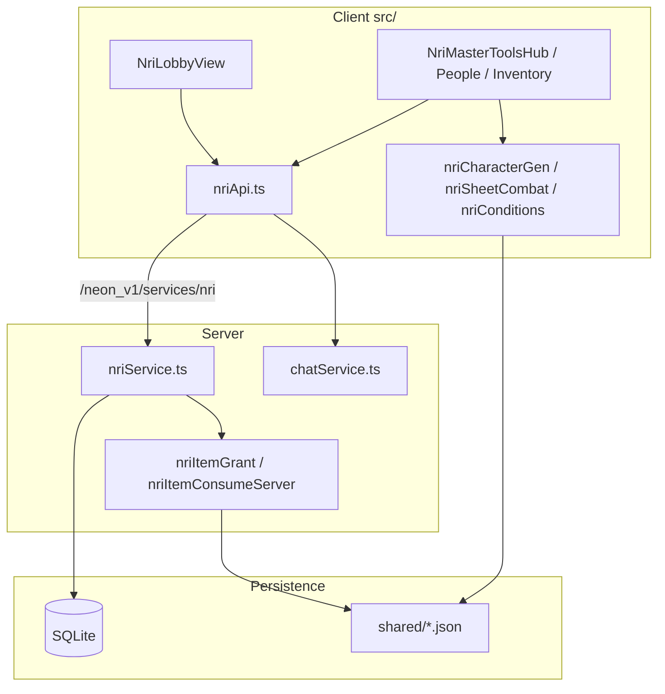

# Neon Protocol — архитектура и стек

Документ для сопровождения: что используется, как связано, где лежит логика, как тестировать и куда двигаться при разделении бэка и фронта.

---

## 1. Инструменты разработки

| Инструмент | Назначение |
|------------|------------|
| **Node.js ≥ 22** | Рантайм сервера и скриптов (Prisma 7.6 требует Node 22+) |
| **npm** | Зависимости и скрипты (`package.json`) |
| **TypeScript 5.9** | Клиент (`tsconfig.app.json`, strict) и сервер (`tsconfig.server.json`) |
| **Vite 8** | Dev-сервер фронта, сборка SPA в `dist/` |
| **ESLint 9** | `npm run lint` |
| **Vitest 3** | Юнит- и интеграционные тесты (`npm test`) |
| **Supertest** | HTTP-тесты Express без поднятия порта |
| **Prisma 7** | ORM, миграции, `prisma generate` |
| **better-sqlite3** | Драйвер SQLite (адаптер Prisma) |
| **ts-node (ESM)** | `npm run dev:server` без предварительной сборки |
| **Cursor / IDE** | Правила в `.cursor/rules/`, заметки в `CURSOR.md` |

### Скрипты

| Команда | Что делает |
|---------|------------|
| `npm run dev:client` | Vite на порту по умолчанию (5173), прокси `/neon_v1` → `:8080` |
| `npm run dev:server` | Express API на `:8080` |
| `npm run build` | `vite build` + `tsc` сервера → `dist/` + `dist_server/` |
| `npm run build:full` | `prisma generate` + `build` (деплой) |
| `npm start` | Прод: один процесс — API + статика из `dist/` |
| `npm test` | Vitest (логика + `server/api.integration.test.ts`) |
| `npm run test:world` | Валидация диалогов мира |
| `npm run test:quests` | Валидация квестов |
| `npm run lint` | ESLint |

### Переменные окружения

| Переменная | Назначение |
|------------|------------|
| `JWT_SECRET` | Подпись JWT (обязательно в проде) |
| `DATABASE_URL` | SQLite, напр. `file:./dev.db` |
| `PORT` | Порт сервера (по умолчанию 8080) |

Шаблон: `.env.example`.

---

## 2. Стек (слои)

```
┌─────────────────────────────────────────────────────────────┐
│  Браузер: React 19 SPA (src/)                               │
│  · components/ — UI (NRI, бой, карта, auth)                 │
│  · logic/      — правила, API-клиент, хуки, мир             │
└───────────────────────────┬─────────────────────────────────┘
                            │ fetch /neon_v1/*
                            ▼
┌─────────────────────────────────────────────────────────────┐
│  Express 5 (server/)                                        │
│  · createApp.ts      — auth, sync, coop in-memory, static   │
│  · services/         — chat, NRI (mount под /services/*)    │
└───────────────────────────┬─────────────────────────────────┘
                            │ Prisma Client
                            ▼
┌─────────────────────────────────────────────────────────────┐
│  SQLite (dev.db / /data/dev.db на хостинге)                 │
└─────────────────────────────────────────────────────────────┘

┌─────────────────────────────────────────────────────────────┐
│  shared/*.json — каталог предметов, эффекты, зоны карты     │
│  (импорт в клиенте, readFileSync на сервере)                │
└─────────────────────────────────────────────────────────────┘
```

| Слой | Технологии |
|------|------------|
| UI | React 19, CSS (`neon-services.css` и др.), lucide-react |
| Клиентская логика | TypeScript, без Redux — контекст + крупные хуки |
| API | REST JSON, префикс `/neon_v1` |
| Auth | JWT Bearer, bcrypt пароли |
| БД | Prisma + SQLite (не PostgreSQL) |
| Контент | TS-модули в `src/logic/world/`, JSON в `shared/` |

---

## 3. Структура репозитория

```
neon_protocol/
├── src/                    # Фронтенд
│   ├── App.tsx             # Роутинг экранов (solo / coop / NRI)
│   ├── components/         # React-компоненты
│   └── logic/              # Доменная логика и API-клиенты
│       ├── hooks/          # useGameState, useCombatLogic
│       ├── world/          # Районы, NPC, диалоги, квесты
│       ├── nriApi.ts       # ~75 fetch-обёрток NRI
│       └── nri*.ts         # Carbon 2185, генерация, бой листа
├── server/
│   ├── index.ts            # Boot: env, migrate, listen
│   ├── createApp.ts        # Ядро HTTP + coop in-memory
│   └── services/           # chatService, nriService, …
├── shared/                 # JSON, общий для клиента и сервера
├── prisma/schema.prisma    # Модели User, GameState, Nri*, Chat*
├── docs/                   # Документация (этот файл, coop cards)
└── scripts/                # Валидаторы контента (не Vitest)
```

---

## 4. Как связаны подсистемы

### 4.1 Solo / карточная игра

- Состояние: `useGameState` + `AuthContext` → `POST /neon_v1/game/sync`.
- Мир: модули `src/logic/world/<district>/` (NPC, объекты, диалоги).
- Квесты: `QUEST_LIBRARY`, привязка к `districtId` и диалогам.
- Бой: `useCombatLogic`, враги в `combatEnemies.ts` (отдельно от NRI-боевиков).

### 4.2 Coop

- Лобби и матч: **in-memory `Map`** в `createApp.ts` (не переживает рестарт, не масштабируется горизонтально).
- Рейтинги стартапов: Prisma `CoopStartupScore`.
- Клиент: `coopLobbyApi.ts`, `coopStartupRankingsApi.ts`.

### 4.3 NRI (настольный Carbon 2185)

- Сессия стола: `NriSession`, invite code, host/admin.
- Игроки: `NriPlayer` (лист JSON + инвентарь).
- Мастер: пресеты, НПС, боевики, карта, сценарий, vault, инструменты (схема, кубики, статусы, генерация).
- API: `server/services/nriService.ts` ↔ `src/logic/nriApi.ts`.
- Правила: `nriCarbon2185.ts`, вкладки в `NriRulesPanel`.
- Предметы: `shared/nri-item-catalog.json`, эффекты расходников — `shared/nri-consume-effects.json`.

### 4.4 Чат

- Комнаты в Prisma; сервис `chatService.ts`.
- Клиент: `chatApi.ts`; в NRI — стол + личка, файлы через vault.

### 4.5 Схема запроса (dev)

```
Browser → Vite :5173
          proxy /neon_v1 → Express :8080
                              ├─ createApp (auth, sync, coop)
                              └─ registerServices (chat, nri)
                                      └─ Prisma → SQLite
```

### 4.6 Схема запроса (prod)

```
Browser → Express :8080
            ├─ /neon_v1/*  API
            └─ /*          static dist/index.html + assets
```

---

## 5. Стабильные контракты (не ломать без миграции)

- `POST /neon_v1/auth/login`, `/register`
- `POST /neon_v1/game/sync` — тело и ответ для `AuthForm` / `AuthContext`
- ID квестов, NPC, узлов карты, `completeQuestId` в диалогах
- Коды ошибок API (`NRI_*`, `SYNC_*`) — клиент парсит `error` / `code`
- `QuestDefinition.id`, `districtId` в фильтрах карты

Подробнее: `.cursor/rules/neon-token-safety.mdc`.

---

## 6. SOLID — аудит и технический долг

| Принцип | Оценка | Проблема | Где |
|---------|--------|----------|-----|
| **S** Single Responsibility | ⚠️ | Один файл — много зон ответственности | `createApp.ts`, `nriService.ts`, `useGameState.ts`, `nriApi.ts` |
| **O** Open/Closed | ⚠️ | Новая фича NRI = правки в god-модулях | Пары client API + server mount |
| **L** Liskov | ⚠️ | `any` в sync payload | `AuthContext`, `game/sync` |
| **I** Interface Segregation | ⚠️ | Компоненты тянут весь `nriApi` | NRI panels |
| **D** Dependency Inversion | ⚠️ | Нет слоя интерфейсов; Prisma/fetch напрямую | Везде |

### Приоритет рефакторинга (без big bang)

1. ~~**Вынести pure domain** в `shared/nri-domain/`~~ — **сделано** (conditions, consume).
2. **Разрезать `nriService.ts`** на роутеры: `nriPlayers.ts`, `nriMap.ts`, `nriVault.ts`, `nriItems.ts`.
3. **Разрезать `useGameState`** на `useSoloGame`, `useCoopLobby`, `useNriInvite`.
4. **Контракты API** — `packages/contracts` или `shared/openapi.yaml` + генерация типов.
5. **Coop in-memory** → Redis/Postgres sessions при необходимости масштаба.

Детальный чеклист: `docs/SOLID_AUDIT.md`.

---

## 7. Тестирование

| Уровень | Что | Команда |
|---------|-----|---------|
| Юнит | Чистая логика (`nriConditions`, `nriSkillPick`, coop scoring) | `npm test` |
| Контракт | `shared/*.json` — уникальные id, ссылки consume→catalog | `npm test` |
| Интеграция | HTTP auth/sync/coop/NRI smoke | `server/api.integration.test.ts` |
| Контент | Диалоги, квесты | `test:world`, `test:quests` |
| Сборка | TS + Vite | `npm run build` |

Пробелы: React-компоненты, E2E, большинство NRI HTTP-маршрутов, Prisma на реальной test DB.

---

## 8. Варианты перехода к раздельному бэку и фронту

### Вариант A — «Мягкое» разделение (рекомендуется первым шагом)

**Суть:** Один репозиторий (monorepo), два пакета `apps/web` + `apps/api`, общий `packages/domain` + `packages/contracts`.

| Плюсы | Минусы |
|-------|--------|
| Минимальный риск для деплоя | Нужна настройка workspaces |
| Общие типы без дублирования | Всё ещё один git |

**Шаги:**
1. `packages/contracts` — Zod/OpenAPI типы для `/neon_v1`.
2. `packages/domain` — pure functions (inventory, conditions, dice, sheet combat).
3. `apps/api` — Express только HTTP + Prisma.
4. `apps/web` — Vite SPA, `VITE_API_URL` вместо proxy.
5. CI: lint + test + build обоих пакетов.

### Вариант B — Отдельные репозитории

**Суть:** `neon-protocol-api` + `neon-protocol-web`, контракт через OpenAPI npm-пакет или git submodule.

| Плюсы | Минусы |
|-------|--------|
| Независимые релизы | Сложнее синхронизировать контракт |
| Разные команды/CI | Версионирование API |

**Когда:** после стабилизации контрактов (вариант A).

### Вариант C — BFF + микросервисы

**Суть:** NRI, chat, coop — отдельные сервисы за gateway.

| Плюсы | Минусы |
|-------|--------|
| Масштаб по доменам | Overkill для текущего размера |
| Coop можно вынести в Redis | Операционная сложность |

**Когда:** нагрузка и команда вырастают; не сейчас.

### Вариант D — SSR / fullstack framework (Next, Remix)

**Суть:** Перенос UI на framework с API routes.

| Плюсы | Минусы |
|-------|--------|
| Один деплой | Большая миграция React SPA |
| SEO (если нужно) | Coop/WebSocket сложнее |

**Когда:** если нужен публичный сайт с SEO; для игрового клиента — низкий приоритет.

### Рекомендуемая дорожная карта

```
Сейчас ──► A: monorepo + packages/domain + contracts
              │
              ▼
         B: split repos (опционально)
              │
              ▼
         C: микросервисы только если coop/NRI требуют scale
```

---

## 9. Связанные документы

| Файл | Содержание |
|------|------------|
| `README.md` | Быстрый старт, деплой |
| `DEV_COOKBOOK.md` | Рецепты разработки |
| `STATE_OF_PROTOCOL.md` | Состояние фич |
| `docs/COOP_CARD_DOCUMENTATION.md` | Coop-карты |
| `docs/SOLID_AUDIT.md` | Чеклист SOLID по модулям |
| `CURSOR.md` | Заметки для агента/IDE |
| `prisma/schema.prisma` | Модель данных |

---

## 10. Диаграмма доменов NRI



*Последнее обновление: 2026-06 — после вкладки МАСТЕР, статусов, consume-effects.*
