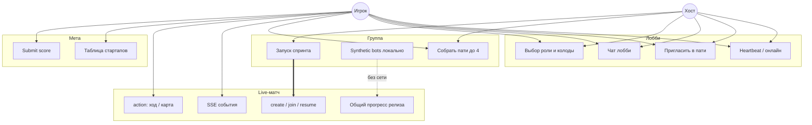
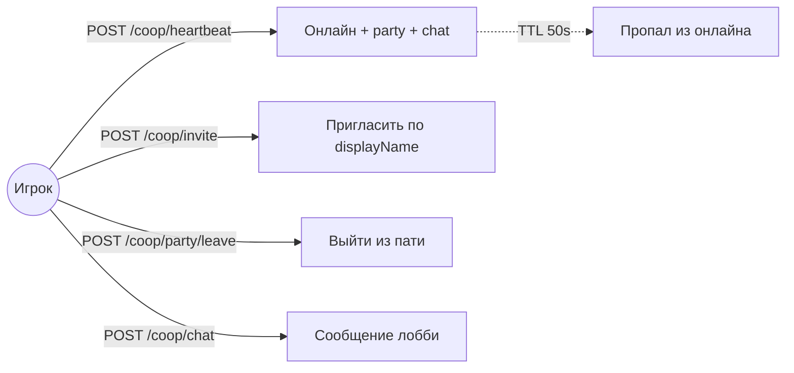
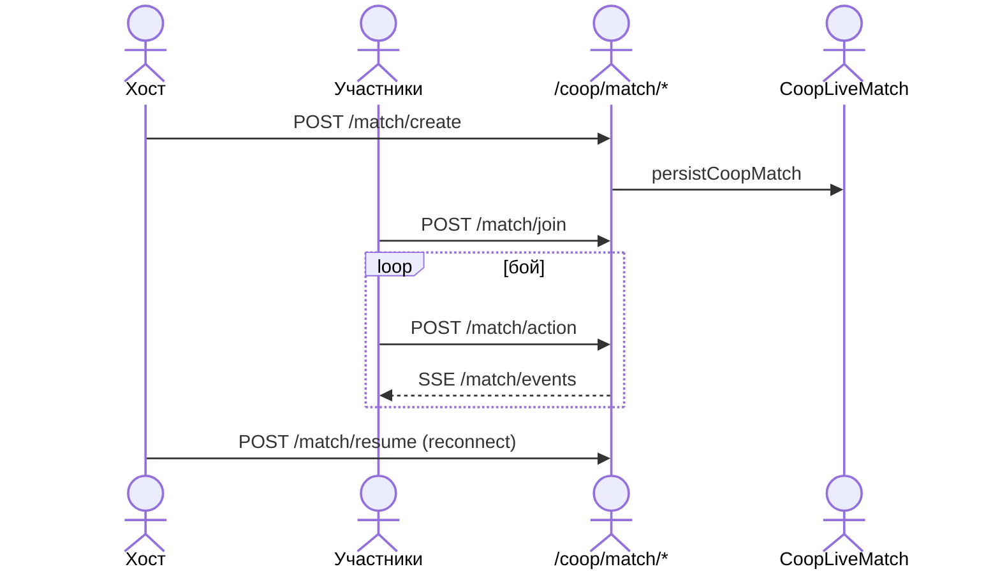
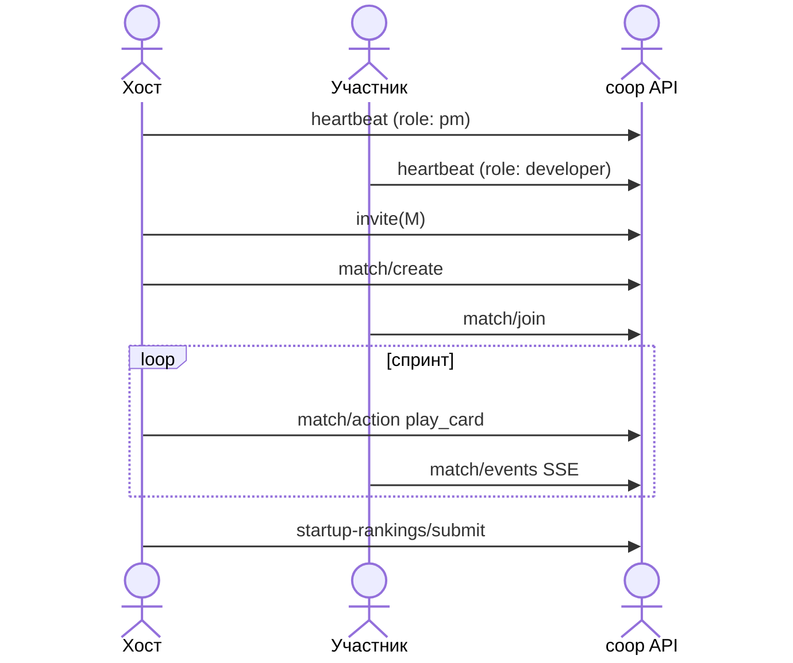

# Coop — схема юзкейсов

> Командный спринт на полигоне `coop_yard`: 4 роли, общий матч, рейтинг стартапов.  
> Связанные документы: [ARCHITECTURE.md](./ARCHITECTURE.md) §4.2 · [design/COOP_MODE_GDD.md](../design/COOP_MODE_GDD.md) · [SOLO_USE_CASES.md](./SOLO_USE_CASES.md)

`sessionMode: 'coop'` · API: `/neon_v1/coop/*` · матч: память + `CoopLiveMatch` в SQLite.

---

## Акторы

| Актор | Описание |
|-------|----------|
| **Игрок** | Авторизованный пользователь с одной из ролей: `admin` \| `developer` \| `qa` \| `pm`. |
| **Хост пати** | Создатель группы. Запускает / возобновляет матч. |
| **Участник пати** | До 4 человек в одной `partyId`. |
| **Союзник-бот** | `synthetic_bots` — один клиент симулирует пустые роли (без live API). |
| **ИИ-оппонент** | Общее давление спринта: THREAT, баги, дедлайн, ICE. |
| **Рейтинг NPC** | Предгенерённые строки в топе стартапов. |

---

## Роли (кооп)

| Роль | Фокус в бою | Стартовые карты |
|------|-------------|-----------------|
| **admin** | Инфра, ресурсы, mitigation | `COOP_STARTER_IDS.admin` |
| **developer** | Код на шине, стек языка | Ядро + пакеты `deckCatalog` |
| **qa** | REACTION / DEFENSIVE, дефекты | QA-реакции |
| **pm** | SOFT, стресс, дедлайн | Процессные карты |

Порядок ролей: `COOP_ROLES` = admin → developer → qa → pm (`sessionMode.ts`).

---

## Общая карта (уровень 1)

---

## Лобби и пати

| Юзкейс | API | Кто |
|--------|-----|-----|
| Heartbeat | `POST /coop/heartbeat` | Все в лобби |
| Состояние | `GET /coop/state` | Все |
| Приглашение | `POST /coop/invite` | Любой участник |
| Выход | `POST /coop/party/leave` | Участник |
| Чат | `POST /coop/chat` | После heartbeat |

**Хранилище лобби:** in-memory `Map` в `mountCoopRoutes.ts` (не переживает рестарт процесса; матч — в БД).

---

## Live-матч

| Юзкейс | API | Ограничение |
|--------|-----|-------------|
| Создать матч | `POST /coop/match/create` | Только хост, нужна пати |
| Войти | `POST /coop/match/join` | `matchId`, член пати |
| Состояние | `GET /coop/match/state` | Участник матча |
| События SSE | `GET /coop/match/events` | Стрим кадров |
| Действие | `POST /coop/match/action` | `play_card`, `end_turn`, … |
| Возобновить | `POST /coop/match/resume` | Хост, после дисконнекта |

Движок: `coopMatchEngine.ts` · персист: `coopMatchStore.ts`.

### Режимы состава

| Режим | `coopSquadFill` | Сеть |
|-------|-----------------|------|
| **Synthetic bots** | `synthetic_bots` | Бой локально на одном клиенте |
| **Live party** | `live_party` | Общий `matchId`, sync через API |

---

## Бой кооп (целевая модель)

| Юзкейс | Описание |
|--------|----------|
| Общий релиз | Одна полоса «приложение в прод» |
| Ролевая задача | У каждой роли свой вклад (dev код, qa тест, admin инфра, pm процесс) |
| Параллельный спринт | Без жёсткого SDLC-фазирования (`coopUnifiedSprintCombat`) |
| Синергии карт | Карты роли влияют на общие метрики |
| Поражение / победа | Общие для команды |

UI: `CoopLobbyView` → `CombatBridge` с `coopMatchId`.

---

## Рейтинг стартапов

| Юзкейс | API | Хранилище |
|--------|-----|-----------|
| Топ-20 | `GET /coop/startup-rankings` | NPC + `CoopStartupScore` |
| Записать рекорд | `POST /coop/startup-rankings/submit` | Только если score выше |

---

## Матрица доступа (кратко)

| Действие | Любой игрок | Хост пати | Участник матча |
|----------|-------------|-----------|----------------|
| Heartbeat / чат лобби | ✓ | ✓ | ✓ |
| Пригласить в пати | ✓ | ✓ | ✓ |
| Создать матч | — | ✓ | — |
| Resume матч | — | ✓ | — |
| Join / action в матче | — | — | ✓ (член пати) |
| Submit рейтинг | ✓ | ✓ | ✓ |

---

## UI ↔ юзкейсы

| Экран | Компонент | Юзкейсы |
|-------|-----------|---------|
| Выбор режима | `SESSION_GATE` | Переключить `sessionMode: coop` |
| Лобби | `CoopLobbyView` | L1–L4, synthetic squad |
| Конструктор роли | `DECK_BUILDER` | Колоды per `coopClassProfiles` |
| Бой | `COMBAT` + `CombatBridge` | M3, live или local |
| Справочник | `REFERENCE` | Кооп-карты по роли |

Save: `coopClassProfiles`, `coopMatchId`, `coopSquadFill` в `game/sync` (`coopClassProfiles.ts`).

---

## API — коды ошибок

| Код | HTTP | Когда |
|-----|------|-------|
| `COOP_NO_TOKEN` | 401 | Нет JWT |
| `COOP_DISPLAY_NAME_REQUIRED` | 400 | Пустой displayName в heartbeat |
| `COOP_HEARTBEAT_FIRST` | 400 | Chat/invite без heartbeat |
| `COOP_CHAT_TEXT_REQUIRED` | 400 | Пустой текст |
| `COOP_TARGET_DISPLAY_NAME_REQUIRED` | 400 | Invite без имени |
| `COOP_PLAYER_NOT_ONLINE` | 404 | Нет в лобби |
| `COOP_TARGET_IN_PARTY` | 400 | Уже в другой группе |
| `COOP_PARTY_FULL` | 400 | > 4 участников |
| `COOP_PARTY_REQUIRED` | 400 | Нет пати для матча |
| `COOP_HOST_ONLY` | 403 | Не хост |
| `COOP_MATCH_ID_REQUIRED` | 400 | Нет matchId |
| `COOP_MATCH_NOT_FOUND` | 404 | Матч не найден |
| `COOP_MATCH_MEMBER_REQUIRED` | 403 | Не в составе |
| `COOP_ACTION_REQUIRED` | 400 | Нет action |
| `COOP_ACTION_UNKNOWN` | 400 | Неизвестный action |
| `STARTUP_NAME_REQUIRED` | 400 | Пустой startupName |

**Формат:** `{ code, message, error }` · UI: `[COOP_HOST_ONLY] Только хост может…`

---

## Типы данных (кратко)

| Сущность | Где | Поля |
|----------|-----|------|
| Lobby entry | in-memory | `userId`, `displayName`, `coopRole`, `partyId`, `lastSeen` |
| Party | in-memory | `id`, `hostId`, `memberIds[]` (max 4) |
| CoopMatch | RAM + SQLite | `id`, `partyId`, `hostId`, `memberIds`, `status`, `shared`, events |
| CoopStartupScore | Prisma | `userId`, `startupName`, `score`, `tierRank`, … |
| Save patch | game/sync | `coopClassProfiles`, `coopMatchId`, `coopSquadFill` |

---

## Сквозной сценарий: от лобби до рейтинга

---

## Вне scope coop

| Режим | Документ |
|-------|----------|
| Solo (кампания) | [SOLO_USE_CASES.md](./SOLO_USE_CASES.md) |
| NRI (стол) | [NRI_USE_CASES.md](./NRI_USE_CASES.md) |

---

## Файлы

| Назначение | Путь |
|------------|------|
| Роуты | `server/coop/mountCoopRoutes.ts` |
| Матч engine | `server/coop/coopMatchEngine.ts` |
| Персист матча | `server/coop/coopMatchStore.ts` |
| Клиент лобби | `src/logic/coopLobbyApi.ts` |
| UI лобби | `src/components/CoopLobbyView.tsx` |
| Роли / колоды | `src/logic/sessionMode.ts` |
| GDD | `design/COOP_MODE_GDD.md` |
| Карты | `docs/COOP_CARD_DOCUMENTATION.md` |
