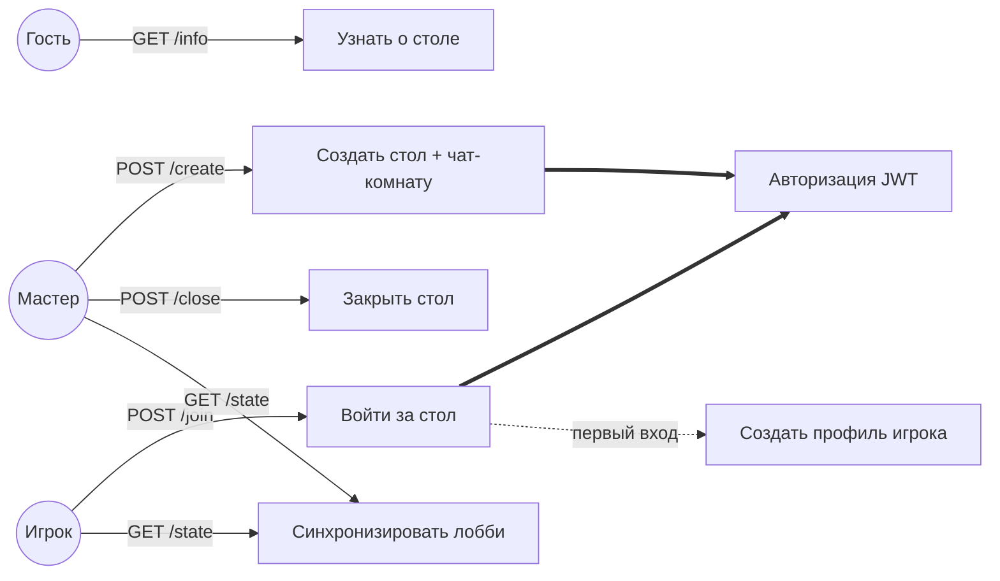
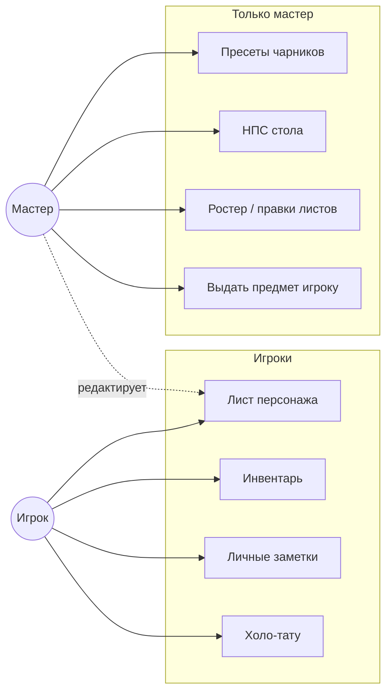
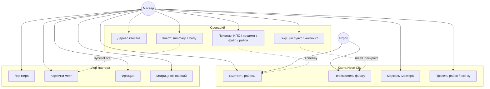
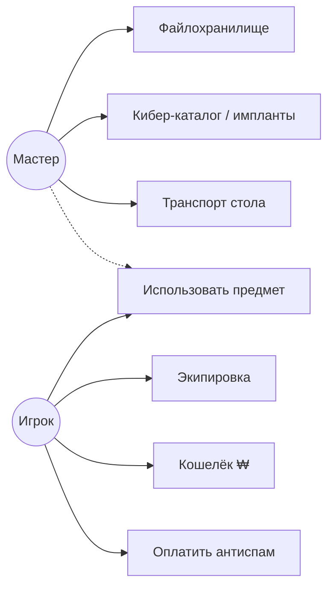
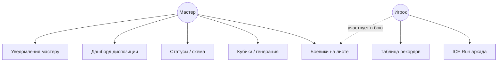
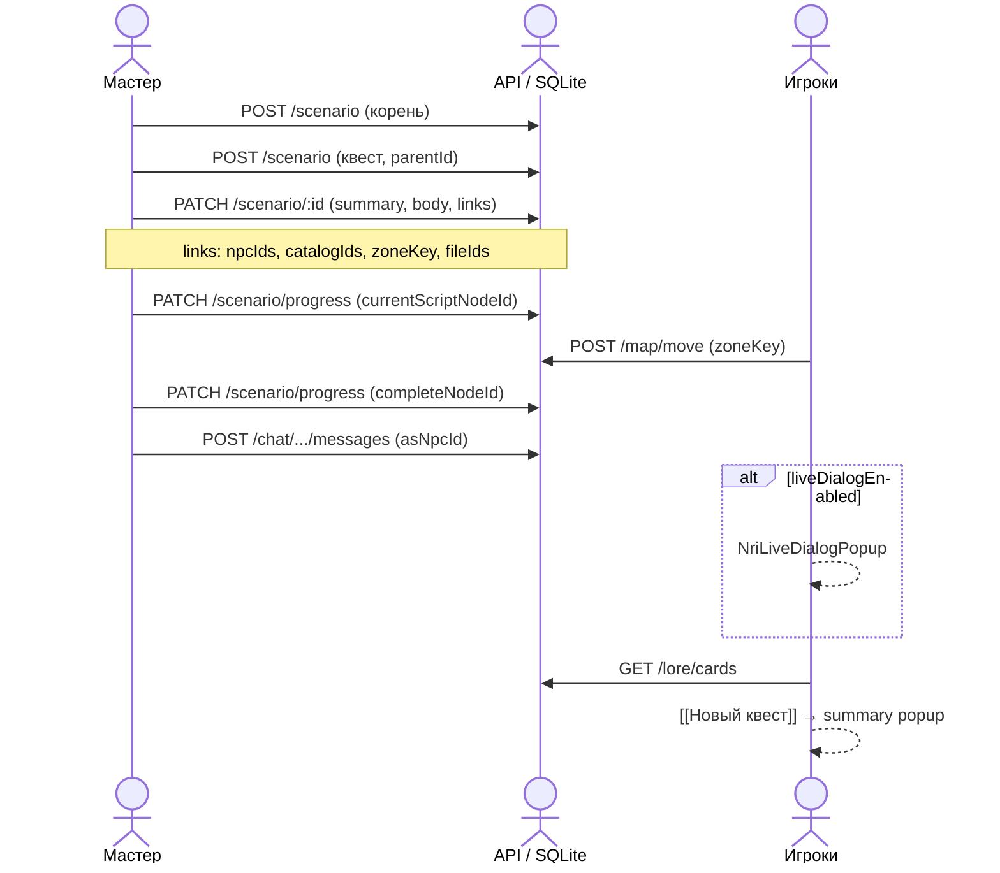

# NRI (Carbon 2185) — схема юзкейсов

> Онлайн-стол: мастер + игроки по invite-коду `NRI-XXXX`.  
> Связанные документы: [ARCHITECTURE.md](./ARCHITECTURE.md) §4.3 · [NRI_DATA_TYPES.md](./NRI_DATA_TYPES.md) · [DEV_COOKBOOK.md](../DEV_COOKBOOK.md) §7

---

## Акторы

| Актор | Описание |
|-------|----------|
| **Мастер** | Создатель стола (`hostUserId`). Полный доступ к лору, сценарию, НПС, картой, инструментам. |
| **Игрок** | Участник с листом персонажа. Чат, карта, инвентарь, ICE, личные заметки. |
| **Админ платформы** | Пользователь с admin-флагом. Может то же, что мастер, на чужих столах (SPAM, закрытие). |
| **SPAM-бот** | Системный участник чата при `spamBotEnabled`. Шлёт рекламные сообщения. |

**Обозначения на диаграммах**

- Сплошная линия — актор выполняет юзкейс.
- `-.->` — опционально / расширение (extend).
- `==>` — обязательное включение (include), например «чат» всегда требует авторизации.

---

## Общая карта (уровень 1)

```mermaid
flowchart TB
  subgraph actors["Акторы"]
    H((Мастер))
    P((Игрок))
    A((Админ))
    B((SPAM-бот))
  end

  subgraph uc_lobby["Лобби и сессия"]
    L1[Создать / закрыть стол]
    L2[Войти по invite]
    L3[Смотреть состав стола]
  end

  subgraph uc_chat["Чат"]
    C1[Писать в стол]
    C2[Личные сообщения]
    C3[Отправить файл из сейфа]
    C4[Писать от лица НПС]
    C5[Живой диалог НПС]
    C6[Подсветка лора [[ссылки]]]
  end

  subgraph uc_chars["Персонажи"]
    CH1[Создать / выбрать лист]
    CH2[Редактировать лист]
    CH3[Пресеты мастера]
    CH4[Управлять НПС]
  end

  subgraph uc_world["Мир"]
    W1[Карта районов]
    W2[Перемещение игроков]
    W3[Лор: места / фракции]
    W4[Сценарий и квесты]
    W5[Файлохранилище]
  end

  subgraph uc_items["Предметы и экономика"]
    I1[Инвентарь / экипировка]
    I2[Выдача предметов]
    I3[Кошелёк ₩ / антиспам]
    I4[Киберимпланты]
    I5[Транспорт стола]
  end

  subgraph uc_play["Мини-игры и бой"]
    G1[ICE Run]
    G2[Боевики на листе]
    G3[Инструменты мастера]
  end

  H --> L1 & L2 & L3
  H --> C1 & C2 & C3 & C4 & C5
  H --> CH2 & CH3 & CH4
  H --> W1 & W2 & W3 & W4 & W5
  H --> I2 & I4 & I5 & G3
  H -.-> A

  P --> L2 & L3
  P --> C1 & C2 & C6
  P --> CH1 & CH2
  P --> W1 & W2
  P --> I1 & I3 & G1

  A --> L1
  B -.-> C1
  H --> B
```

---

## Лобби и сессия



| Юзкейс | API | Кто |
|--------|-----|-----|
| Создать стол | `POST /nri/create` | Мастер |
| Войти | `POST /nri/:code/join` | Игрок |
| Состояние лобби | `GET /nri/:code/state` | Все участники |
| Закрыть | `POST /nri/:code/close` | Мастер |
| SPAM-бот | `POST /nri/:code/spam-bot` | Мастер |
| Живой диалог | `POST /nri/:code/live-dialog` | Мастер |

---

## Чат и коммуникация

```mermaid
flowchart TB
  H((Мастер))
  P((Игрок))

  subgraph table["Стол #чат"]
    UC_MSG[Отправить сообщение]
    UC_NPC[Сообщение от НПС]
    UC_LIVE[Попап живого диалога]
    UC_LORE[Клик по [[карточке]]]
    UC_FILE[Файл в чат]
    UC_DM[Личка игроку]
    UC_ITEM[Передать предмет в личке]
  end

  H --> UC_MSG & UC_NPC & UC_DM & UC_ITEM & UC_FILE
  P --> UC_MSG & UC_DM
  P --> UC_LORE
  H --> UC_LIVE

  UC_NPC ==> UC_LIVE
  UC_LIVE -.->|после «Далее»| UC_MSG
  UC_MSG & UC_NPC ==> UC_CARDS[GET /lore/cards]
  UC_LORE ==> UC_CARDS
```

| Юзкейс | Где | Кто видит summary |
|--------|-----|-------------------|
| Обычное сообщение | `NeonChatPanel` | — |
| От лица НПС | `asNpcId` в chat API | — |
| Живой диалог | `NriLiveDialogPopup` | все за столом |
| Карточка лора | `LoreCardPopup` | **только summary** |
| Файл | vault → chat | по правам файла |

---

## Персонажи, НПС, пресеты



---

## Карта, лор, сценарий



**Разделение видимости лора**

| Данные | Мастер (`GET /lore`) | Игрок (`GET /lore/cards`) |
|--------|----------------------|---------------------------|
| Место / фракция / запись | summary + body/description | summary |
| Квест (узел сценария) | summary + body | summary по title |

---

## Предметы, сейф, экономика



---

## ICE Run, бой, инструменты мастера



---

## Сквозной сценарий: «Квест от идеи до чата»

Последовательность для мастера (позитивный путь):



---

## Матрица доступа (кратко)

| Зона | Мастер | Игрок | API-ограничение |
|------|--------|-------|-----------------|
| Лобби / закрытие | ✓ | вход | `requireHost` |
| Полный лор | ✓ | — | `NRI_HOST_ONLY` |
| Карточки лора / чат | ✓ | ✓ | участник стола |
| Сценарий (редактор) | ✓ | — | `NRI_HOST_ONLY` |
| Карта (просмотр) | ✓ | ✓ | member |
| Карта (редакт районов) | ✓ | — | host |
| НПС / пресеты / vault write | ✓ | read vault* | host |
| Сообщение от НПС | ✓ | — | `CHAT_NPC_HOST` |
| ICE / кошелёк | ✓ | ✓ | свой профиль |

\* Игрок видит файлы, расшаренные в чат; создание — мастер.

---

## UI ↔ юзкейсы

| Вкладка `NriLobbyView` | Основные юзкейсы |
|------------------------|------------------|
| Чат | C1–C6, антиспам |
| ICE | G1, рекорды |
| Карта | W1, W2 |
| Кошелёк | I3 |
| Инвентарь | I1, I2 |
| Файлохранилище | W5 |
| Люди | CH*, НПС, пресеты |
| Кибер | I4 |
| Лор / Сценарий | W3, W4 |
| Транспорт | I5 |
| Мастер | G3, SPAM, живой диалог |

---

## Вне scope NRI (но рядом)

| Режим | Документ |
|-------|----------|
| **Solo** | [SOLO_USE_CASES.md](./SOLO_USE_CASES.md) |
| **Coop** | [COOP_USE_CASES.md](./COOP_USE_CASES.md) |
| Auth / sync | `POST /neon_v1/auth/*`, `/game/sync` |
