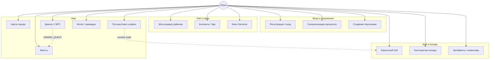
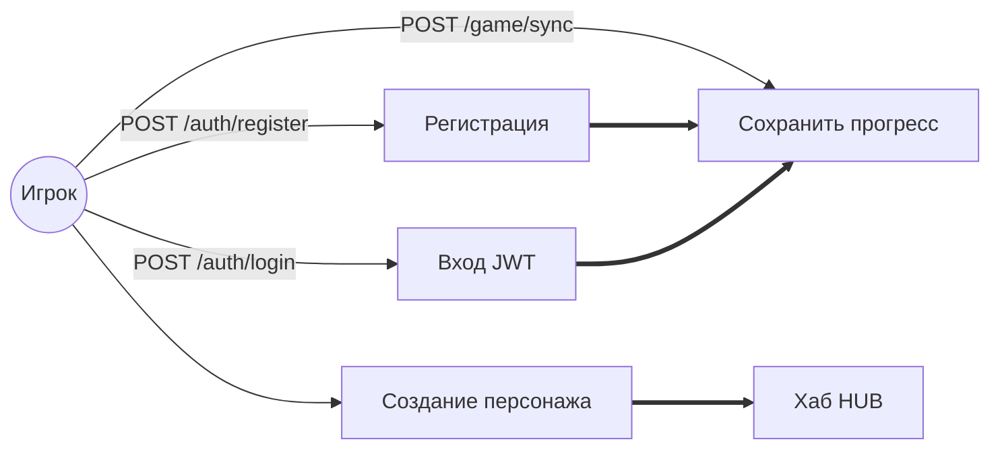
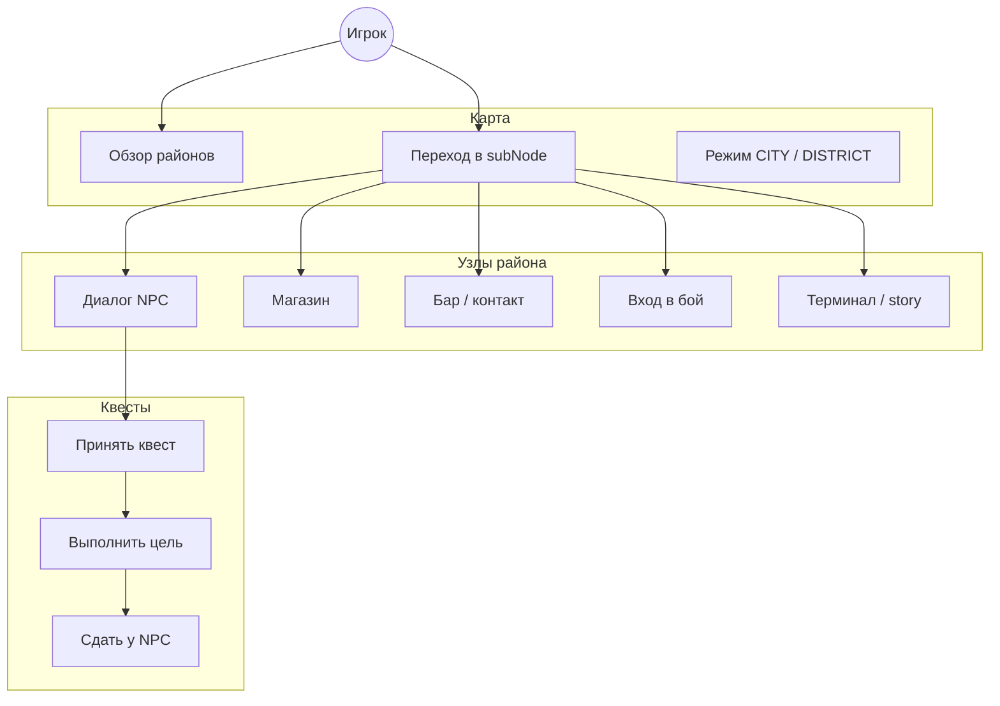
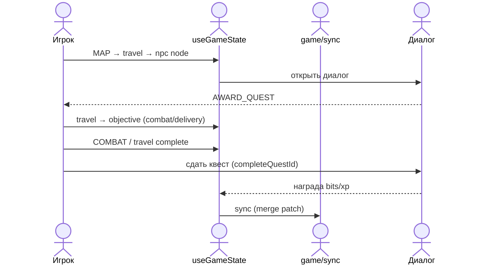

# Solo — схема юзкейсов

> Одиночная кампания Night City: карта районов, NPC, квесты, карточный бой, мессенджер.  
> Связанные документы: [ARCHITECTURE.md](./ARCHITECTURE.md) §4.1 · [COOP_USE_CASES.md](./COOP_USE_CASES.md) · [NRI_USE_CASES.md](./NRI_USE_CASES.md)

`sessionMode: 'solo'` · сохранение через `POST /neon_v1/game/sync` → Prisma `GameState` + `clientSnapshot`.

---

## Акторы

| Актор | Описание |
|-------|----------|
| **Игрок** | Авторизованный пользователь. Ведёт одного персонажа по городу. |
| **NPC** | Диалоговые деревья в `src/logic/world/<district>/`. Выдают квесты, лор, торговлю. |
| **Система мира** | День/ночь, репутация фракций, SPAM в мессенджере, случайные события. |
| **Оппонент (бой)** | Враги на узлах `combat` — отдельная колода ИИ, не кооп-матч. |

---

## Общая карта (уровень 1)

---

## Вход, персонаж, сохранение

| Юзкейс | API / хранилище | Данные |
|--------|-----------------|--------|
| Регистрация | `POST /neon_v1/auth/register` | Стартовая колода + `GameState` |
| Вход | `POST /neon_v1/auth/login` | JWT + полный `gameState` |
| Sync | `POST /neon_v1/game/sync` | Merge в колонки + `clientSnapshot` |
| Локальный кэш | `localStorage` `neon_user` | Гидрация через `sanitizeClientGameState` |

### Ключевые поля save (solo)

| Поле | Тип | Назначение |
|------|-----|------------|
| `bits`, `xp`, `level` | number | Экономика / прогресс |
| `stress`, `maxStress` | number | Стресс персонажа |
| `activeDeck`, `inventory` | array | Карты боя |
| `completedQuests` | array | Завершённые квесты |
| `reputation` | object | Фракции |
| `intel` | array | Фрагменты разведки |
| `currentView`, `sessionMode` | string | UI + режим (`solo`) |
| `activeDistrictId`, `playerNodeId` | string | Позиция на карте |
| `questStates`, `messengerFeed`, … | mixed | В `clientSnapshot` |

Валидация sync: `shared/api-schemas/gameSync.ts` · санитизация: `saveHydrationGuards.ts`.

---

## Мир, квесты, диалоги

| Юзкейс | Где в коде | Контракт |
|--------|------------|----------|
| Библиотека квестов | `QUEST_LIBRARY` / `questData.ts` | `QuestDefinition.id` стабилен |
| Диалоги | `world/<district>/npcs/*/dialogues.ts` | `completeQuestId`, `AWARD_QUEST` |
| Движение | `useGameState.handleTravel` | `MAP_NODES`, `districtId` |
| Журнал | `QUEST_LOG` view | `questStates` в save |
| Интел | `INTEL` view | `intelFragments` |

**Правило:** награда квеста — только при **ручной сдаче** у NPC (`completeQuestId` в диалоге), не авто при бое.

---

## Бой и колода (solo)

| Юзкейс | View | Логика |
|--------|------|--------|
| Бой на узле | `COMBAT` | `useCombatLogic`, враги `combatEnemies.ts` |
| Конструктор | `DECK_BUILDER` | `CARD_LIBRARY`, лимиты колоды |
| Справочник карт | `REFERENCE` | Каталог без кооп-ролей |
| Персонаж | `CHARACTER` | Статы, класс, прогресс |

Бой solo **не** использует `/neon_v1/coop/match/*` — состояние боя локально до sync.

---

## Мессенджер и социальный слой

| Юзкейс | Описание |
|--------|----------|
| Районный канал | Чат привязан к `districtId` |
| Контакты дня/ночи | `dayContacts` / `nightContacts` |
| Бар фиксера | `FIXER_BAR` — квесты, слухи |
| SPAM / слухи | `messengerFeed`, санитизация ников |
| Репутация | Влияет на диалоги и доступ |

---

## Матрица доступа (кратко)

| Зона | Игрок | API / ограничение |
|------|-------|-------------------|
| Вход в режим | ✓ | `SESSION_GATE` → `sessionMode: solo` |
| Карта / путешествие | ✓ | `useGameState`, узлы `MAP_NODES` |
| Диалоги / квесты | ✓ | Клиент + sync `questStates` |
| Бой на узле | ✓ | Локально, не `/coop/match` |
| Колоды / инвентарь | ✓ | Свой save, merge sync |
| Sync прогресса | ✓ | JWT, только свой `userId` |
| Coop / NRI API | — | Другой `sessionMode` |

---

## UI ↔ юзкейсы

| `currentView` | Основные юзкейсы |
|---------------|------------------|
| `SESSION_GATE` | Выбор режима (solo / coop / NRI) |
| `CREATION` | Создание персонажа |
| `HUB` | Мессенджер, навигация |
| `MAP` | Карта, путешествие |
| `FIXER_BAR` | Бар, контакты |
| `QUEST_LOG` | Активные квесты |
| `INTEL` | Разведданные |
| `COMBAT` | Карточный бой |
| `DECK_BUILDER` | Сборка колоды |
| `CHARACTER` | Лист персонажа |
| `REFERENCE` | Справочник |
| `NEON_SERVICES` | Сервисы (чат общий и т.д.) |

Управление: `useGameState` (~1900 строк) — целевой split: `useSoloGame`.

---

## API и коды ошибок

| Маршрут | Назначение |
|---------|------------|
| `POST /neon_v1/auth/register` | Новый аккаунт |
| `POST /neon_v1/auth/login` | JWT + gameState |
| `POST /neon_v1/game/sync` | Патч прогресса |

| Код | HTTP | Когда |
|-----|------|-------|
| `REGISTER_INVALID_INPUT` | 400 | Невалидный логин/пароль |
| `REGISTER_DUPLICATE` | 400 | Логин занят |
| `REGISTER_FAILED` | 400 | Ошибка сервера |
| `LOGIN_REJECTED` | 401 | Неверные credentials |
| `LOGIN_SERVER` | 500 | Ошибка входа |
| `SYNC_NO_TOKEN` | 401 | Нет JWT |
| `SYNC_INVALID_BODY` | 400 | Zod / схема sync |
| `SYNC_NO_STATE` | 404 | Нет GameState |
| `SYNC_INVALID_TOKEN` | 401 | JWT истёк |
| `SYNC_FAILED` | 500 | Ошибка записи |

**Формат ответа:** `{ code, message, error }` · в UI: `[CODE] сообщение` (`formatNriApiError` / auth client).

---

## Сквозной сценарий: квест в районе

---

## Вне scope solo

| Режим | Документ |
|-------|----------|
| Coop (пати, спринт) | [COOP_USE_CASES.md](./COOP_USE_CASES.md) |
| NRI (стол мастера) | [NRI_USE_CASES.md](./NRI_USE_CASES.md) |

---

## Файлы

| Назначение | Путь |
|------------|------|
| Состояние игры | `src/logic/hooks/useGameState.ts` |
| Sync клиент | `src/logic/AuthContext.tsx` |
| Sync сервер | `server/routes/auth.ts` |
| Схема sync | `shared/api-schemas/gameSync.ts` |
| Save guards | `src/logic/saveHydrationGuards.ts` |
| Квесты | `src/logic/questData.ts`, `questEngine.ts` |
| Мир | `src/logic/world/**` |
| Бой | `src/logic/hooks/useCombatLogic.ts` |
| Карты | `src/logic/combatCards.ts` |
